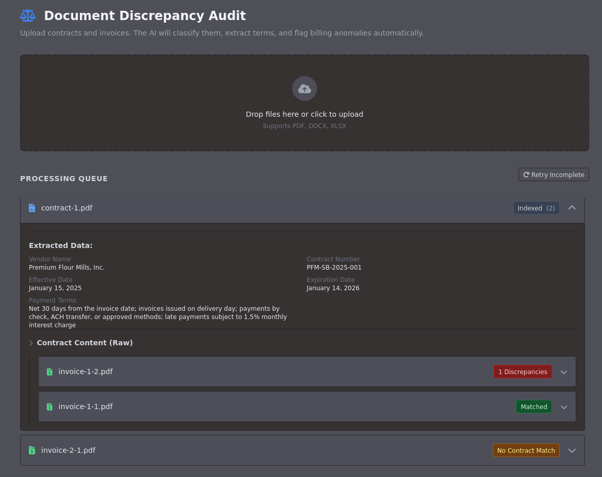

!!! **WARNING**: This is a Proof of Concept. The codebase is currently untested and intended for demonstration purposes only !!!

This PoC was inspired by the following projects:
- https://github.com/run-llama/invoice-reconciler
- https://github.com/run-llama/template-workflow-extract-basic

# Extraction & Reconciliation Workflow

This application implements an automated document processing pipeline using event-driven workflows. It ingests documents, classifies them into categories (e.g., Invoices, Contracts), extracts structured metadata, and audits invoices against available contracts to identify discrepancies in payment terms or amounts.

## Features

- **Ingestion**: Asynchronous file processing via WebSocket.
- **Classification**: [LlamaIndex Classify](https://developers.llamaindex.ai/python/cloud/llamaclassify/getting_started/)
- **Extraction**: [LlamaIndex Parse](https://www.llamaindex.ai/llamaparse)
- **Reconciliation**: GPT 4.1 mini.
- **Real-time Dashboard**: HTMX-based interface for monitoring processing status and viewing results.



## Installation

Requires Python 3.10+.

1. **Install Dependencies**
   Using `uv``:
   ```bash
   uv sync
   ```

2. **Configuration**
   Set the following environment variables:
   ```bash
   export OPENAI_API_KEY=sk-...
   export LLAMA_CLOUD_API_KEY=llx-...
   ```

3. **Execution**
   Run the FastAPI server:
   ```bash
   fastapi dev app/main.py
   ```
